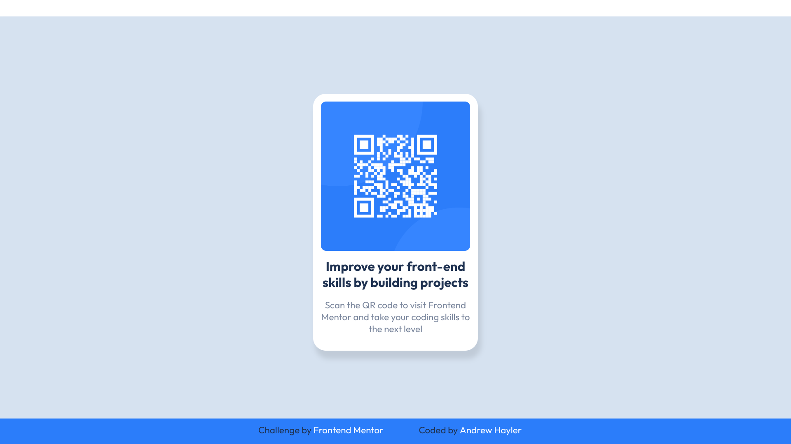

# Frontend Mentor - QR code component solution

This is a solution to the [QR code component challenge on Frontend Mentor](https://www.frontendmentor.io/challenges/qr-code-component-iux_sIO_H). Frontend Mentor challenges help you improve your coding skills by building realistic projects. 

## Table of contents

- [Overview](#overview)
  - [Screenshot](#screenshot)
  - [Links](#links)
- [My process](#my-process)
  - [Built with](#built-with)
  - [What I learned](#what-i-learned)
- [Author](#author)

## Overview

### Screenshot




### Links

- Solution URL: [Github](https://github.com/BoldlyCodingNowhere/F_M-qr-code-component)
- Live Site URL: [Github pages](https://boldlycodingnowhere.github.io/F_M-qr-code-component)

## My process

### Built with

- Semantic HTML5 markup
- CSS custom properties
- Flexbox
- Mobile-first workflow
- Linux Debian Cli
- [Github](https://github.com) - Github repo and Pages
- [Figma](https://figma.com/) - Figma

### What I learned

This project helped me better understand and implement a workflow that helped break the process down in to manageable stages that build upon each other logically. Starting with planning I reverse engineered the  desktop design in Figma as a means to learn the basics of this application. This  

I also used the project to practice using git through the Debian Cli and Github.

After building the qr-code page I realised I had missed adding in a footer that linked to both the Frontend Mentor challenge, but also adding my name to the page. I am pleased with the hover transistion on these footer link elements:

```css
a {
  text-decoration: none;
  color: var(--white);
  box-shadow: inset 0 0 0 0 var(--qr-blue);
  margin: 0 -.25rem;
  padding: 0 .25rem;
  cursor: pointer;
  transistion: color .3s ease-in-out, box-shadow .3s ease-in-out;
}

a:hover {
  color: var(--qr-blue);
  box-shadow: inset 140px 0 0 0 var(--white);
}
```


## Author

- Frontend Mentor - [@BoldlyCodingNowhere](https://www.frontendmentor.io/profile/BoldlyCodingNowhere)
- Twitter - [@CodeAndrewH1](https://www.x.com/CodeAndrewH1)


